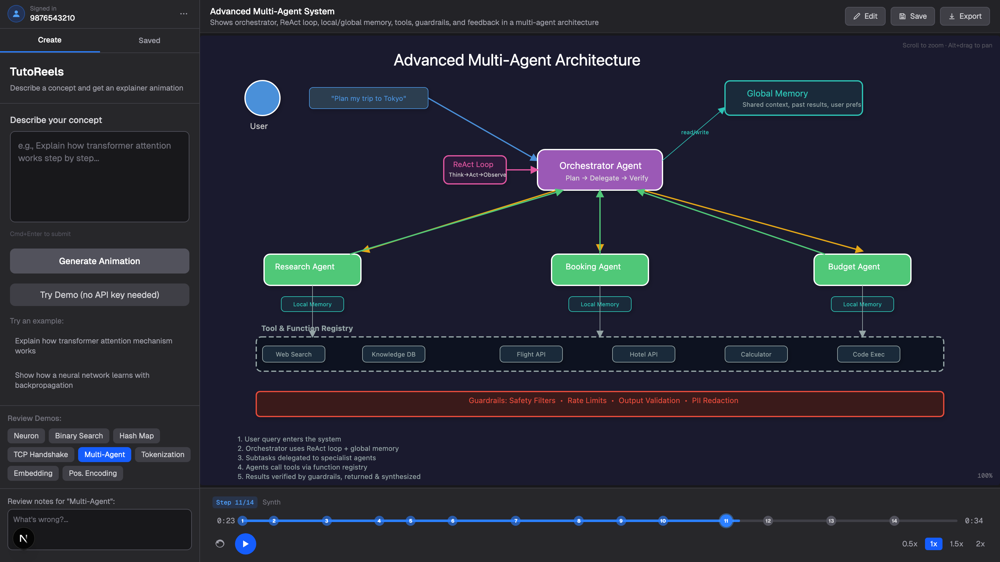
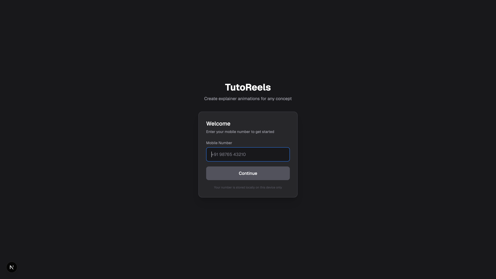
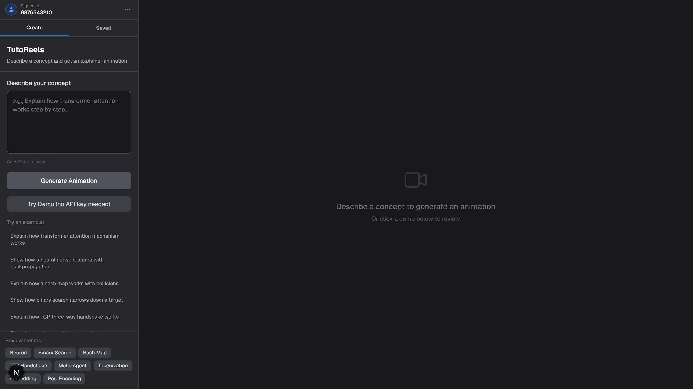
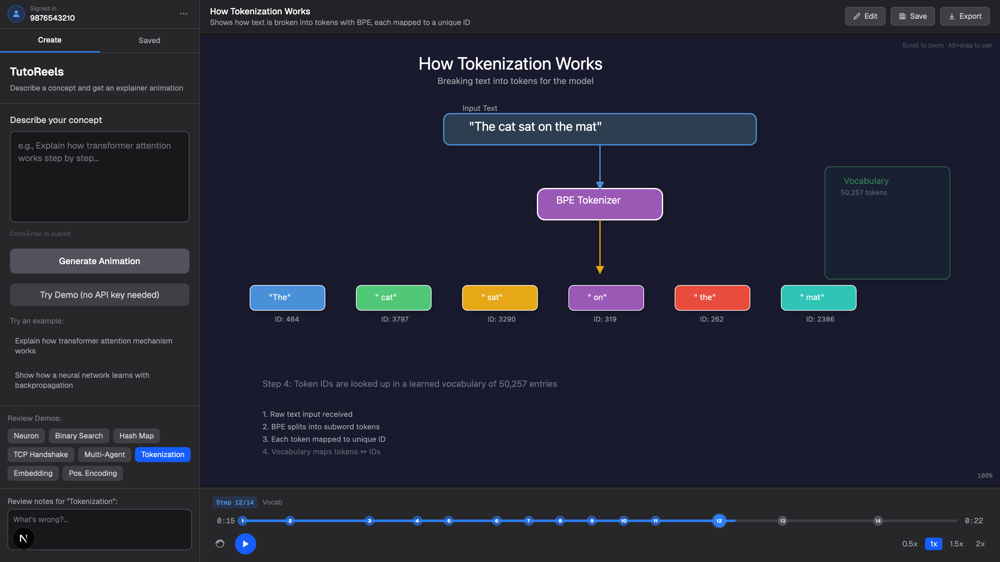
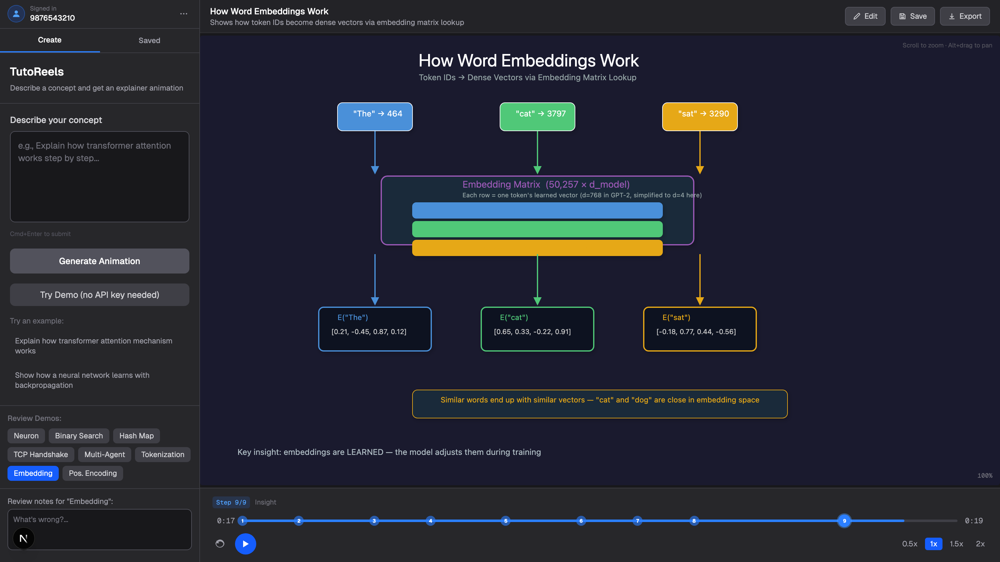
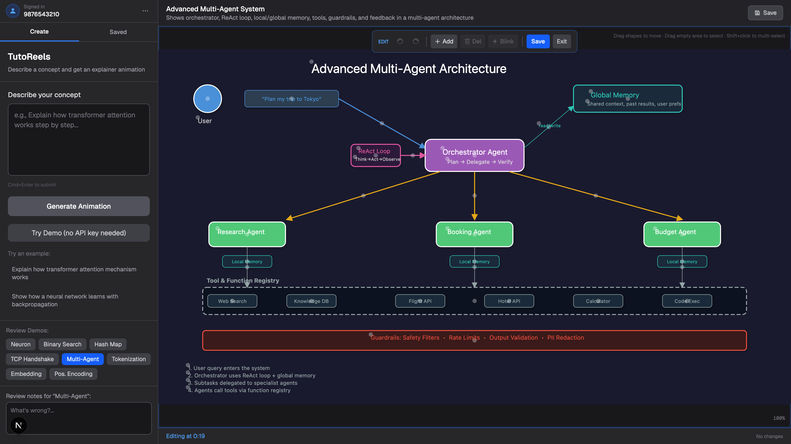
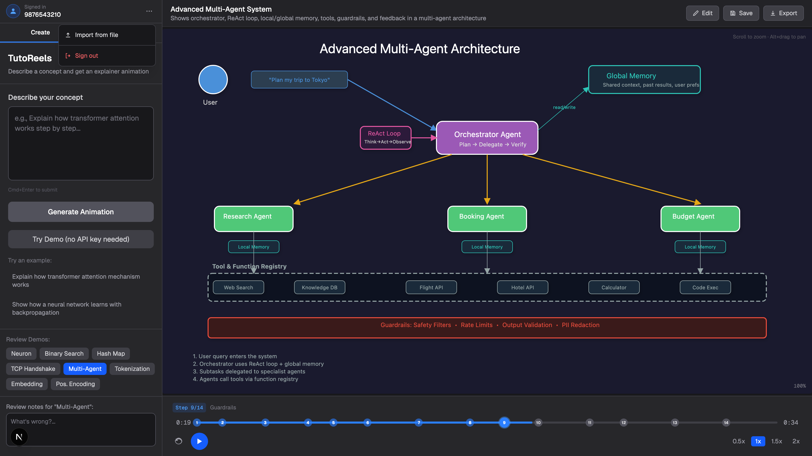

# TutoReels

**Turn any concept into a step-by-step explainer animation.**

TutoReels is a local-first web app that takes a plain-English description — _"Explain how transformer attention works"_ — and generates a narrated, step-sequenced animation on an HTML canvas. You can scrub the timeline, edit any shape inline, save versions, and export animations to disk.

Under the hood it asks Claude to produce a structured **scene graph** (shapes + a timeline of actions), which a deterministic animation engine then renders with Konva. No video rendering, no pre-baked assets — everything is a live, editable scene.

<p align="center">
  
</p>

---

## Highlights

- **Generate from text** — describe a concept, Claude produces a scene graph, the engine animates it.
- **8 built-in demos** — Neuron, Binary Search, Hash Map, TCP Handshake, Multi-Agent system, Tokenization, Word Embeddings, Positional Encoding. No API key needed to review them.
- **Timeline scrubber** — play/pause, seek, step markers, 0.5x / 1x / 1.5x / 2x speed.
- **Inline editor** — select shapes, drag / resize / rotate, change colors, add new shapes, delete, undo/redo, rubber-band multi-select, keyboard nudge. Every edit is a delta applied at the current time so existing animation keyframes stay intact.
- **Save & load** — save finalised animations to `localStorage`, or **export to a `.json` file** and re-import later. Your library survives browser wipes.
- **Lightweight login** — mobile number is stored locally as an identifier. No passwords, no OTP, no server.
- **Regenerate / iterate** — tweak your prompt and regenerate; leave review notes on demos.
- **Runs entirely on your machine** — Next.js dev server, your own Anthropic API key, no telemetry.

---

## Screenshots

### Log in with a mobile number (local identifier only)

<p align="center">
  
</p>

### Describe a concept, or click a demo to review

<p align="center">
  
</p>

### Rich, step-sequenced animations

| Tokenization (BPE → IDs) | Word embeddings (matrix lookup) |
|:---:|:---:|
|  |  |

### Edit any shape inline

Drag, resize, rotate, recolor, add, delete. Every edit is a delta so existing keyframes stay intact.

<p align="center">
  
</p>

### Export, import, sign out — all from the account menu

<p align="center">
  
</p>

---

## Install (for friends trying it out)

> **Requires:** Node.js 20 or newer, and an [Anthropic API key](https://console.anthropic.com/settings/keys).
> The free tier works fine — each animation costs a few cents.

```bash
# 1. Clone the repo
git clone https://github.com/say-binary/tutoreels.git
cd tutoreels

# 2. Interactive setup (asks for your API key, installs deps)
npm run setup

# 3. Start the dev server
npm run dev
```

Then open **[http://localhost:3000](http://localhost:3000)** in your browser.

That's it. On first launch you'll be asked for a mobile number — it's stored **only in your browser** as an identifier (no OTP, no server).

### What `npm run setup` does

- Verifies you're on Node 20+.
- Prompts for your Anthropic API key (hidden input) and writes it to `.env.local`.
- Runs `npm install`.

You can re-run `npm run setup` any time to change the API key.

### Manual setup (if you prefer)

```bash
npm install
echo "ANTHROPIC_API_KEY=sk-ant-your-key-here" > .env.local
npm run dev
```

---

## How it works

```
 User prompt ──► /api/generate ──► Claude (Sonnet 4)
                                       │
                                       ▼
                                   Scene Graph
                    { metadata, assets[], timeline[] }
                                       │
                                       ▼
                               AnimationEngine
                     (computes shape state at time T)
                                       │
                                       ▼
                            Konva canvas renderer
                        (+ inline editor overlay)
```

- **`src/ai/`** — prompt templates, Zod scene graph schema, validation, concept-enrichment pass.
- **`src/engine/`** — deterministic animation engine. Given a scene graph and a time `t`, it returns the computed state of every shape (position, rotation, scale, opacity, etc.).
- **`src/components/Canvas/`** — Konva-based renderer with drag / resize / rotate handles in edit mode.
- **`src/hooks/useEditHistory.ts`** — an overrides map + undo/redo history. Edits are stored as deltas that are applied to `initialState` on save.
- **`src/lib/savedStorage.ts`** — `localStorage` persistence plus `exportToFile` / `importFromFile` for JSON round-trips.
- **`src/app/api/generate/route.ts`** — Claude call with a retry loop that validates the JSON output against the schema and sends validation errors back to Claude for self-correction.

---

## Scripts

| Command | What it does |
|---|---|
| `npm run setup` | Interactive first-time setup (API key + install). |
| `npm run dev` | Next.js dev server on port 3000. |
| `npm run build` | Production build. |
| `npm run start` | Run the production build. |
| `npm run lint` | ESLint. |

---

## Tech stack

- **[Next.js 16](https://nextjs.org)** (App Router, Turbopack)
- **React 19** + TypeScript
- **[Konva](https://konvajs.org) / react-konva** for the canvas
- **[Claude Sonnet 4](https://www.anthropic.com/claude)** via `@anthropic-ai/sdk`
- **[Zod](https://zod.dev)** for scene graph validation
- **Tailwind CSS v4**

---

## Privacy & data

- Your **Anthropic API key** lives only in `.env.local` on your machine.
- Your **mobile number** is stored only in your browser's `localStorage` (key: `tutoreels_user`). You can wipe it from the account menu or devtools.
- **Saved animations** live in `localStorage` (key: `tutoreels_saved`) plus any `.json` files you export.
- **No analytics, no telemetry, no server** apart from the Next.js API route that proxies your prompt to Anthropic's API.

---

## Troubleshooting

**"Anthropic API key not configured"** — re-run `npm run setup`, or check `.env.local` contains `ANTHROPIC_API_KEY=sk-ant-…`, then restart `npm run dev`.

**Port 3000 is in use** — kill the other process or run `PORT=3001 npm run dev`.

**Turbopack "Failed to open database"** — `rm -rf .next && npm run dev`.

**Animations look wrong after editing** — in edit mode, use `Cmd+Z` to undo. If a scene breaks, click **Exit** (discards unsaved edits) or reload a saved version from the Saved tab.

---

## License

Private / personal project. Ask before redistributing.
